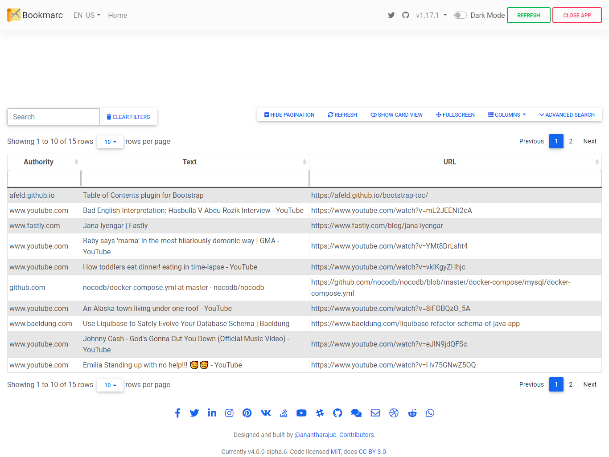

<!--
*** Thanks for checking out Bookmarc. If you have a suggestion that would 
*** make this better, please fork the repo and create a pull request
*** or simply open an issue with the tag "enhancement". Thanks again!
-->

# Bookmarc

<p align="center">Portable Web Browsers' Bookmark's Manager.</p>

<p align="center">
   
</p>

<div align="center">

[](CODE_OF_CONDUCT.md) [](https://twitter.com/intent/tweet?text=Checkout+Bookmarc+web+application&url=https://github.com/AnanthaRajuC/Bookmarc&hashtags=SpringBoot) [](https://twitter.com/anantharajuc)
</div>

<div align="center">
  <sub>Built with ❤︎ by <a href="https://twitter.com/anantharajuc">Anantha Raju C</a> and <a href="https://github.com/AnanthaRajuC/Bookmarc/graphs/contributors">contributors</a>
</div>

</br>

<p align="center">
	<a href="https://github.com/AnanthaRajuC/Bookmarc/blob/main/README.md#bookmarc"><strong>Explore the docs »</strong></a>
	<br />
	<br />
	<a href="https://github.com/AnanthaRajuC/Bookmarc/issues">Report Bug</a>
	·
	<a href="https://github.com/AnanthaRajuC/Bookmarc/issues">Request Feature</a>
</p>


| [](http://godban.github.io/browsers-support-badges/)</br>IE / Edge | [](http://godban.github.io/browsers-support-badges/)</br>Firefox | [](http://godban.github.io/browsers-support-badges/)</br>Chrome | [](http://godban.github.io/browsers-support-badges/)</br>Safari | [](http://godban.github.io/browsers-support-badges/)</br>iOS Safari | [](http://godban.github.io/browsers-support-badges/)</br>Samsung | [](http://godban.github.io/browsers-support-badges/)</br>Opera |
| --------- | --------- | --------- | --------- | --------- | --------- | --------- |
| Test Pending| Test Pending| supported | Test Pending| Test Pending| Test Pending| Test Pending

|     Service     | Badge | Badge | Badge | Badge | Badge |
|-----------------|-------|-------|-------|-------|-------|
|  **GitHub**     |[](https://github.com/AnanthaRajuC/Bookmarc/commits/master)|[](https://github.com/AnanthaRajuC/Bookmarc/pulls)|[](https://github.com/AnanthaRajuC/Bookmarc/issues)|[](https://github.com/AnanthaRajuC/Bookmarc/network)|[](https://github.com/AnanthaRajuC/Bookmarc/stargazers)|
|  **GitHub**     ||||||
|    **lgtm**     |[](https://lgtm.com/projects/g/AnanthaRajuC/Bookmarc?mode=list)|[](https://lgtm.com/projects/g/AnanthaRajuC/Bookmarc?mode=list)|[](https://lgtm.com/projects/g/AnanthaRajuC/Bookmarc?mode=list)|[](https://lgtm.com/projects/g/AnanthaRajuC/Bookmarc?mode=list)|[](https://lgtm.com/projects/g/AnanthaRajuC/Bookmarc?mode=list)|

[](https://twitter.com/intent/tweet?text=Checkout+this+portable+web+browser+bookmark+manager&url=https://github.com/AnanthaRajuC/Bookmarc&hashtags=WebBrowser) [](https://twitter.com/anantharajuc)

## Important Note: This project's new milestone is to improve performance when processing bookmarks in the thousands, so stay tuned.

Update `chrome.bookmarks.file.windows` in **application.properties** file with your computer's username.

## Application screenshots

[](documents/images/app-ui/home.png)

## Details

- [Technology stack & other Open-source libraries](documents/TECHNOLOGY_STACK.MD)  
- [Technical Functionalities and To-Do](documents/TECHNICAL_FUNCTIONALITIES.md)  
- [Installation](documents/INSTALLATION.MD)  
- [Changelog](documents/CHANGELOG.md) 
- [Internationalization (i18n)](documents/INTERNATIONALIZATION.MD) 
- [Documentation](documents/DOCUMENTATION.MD) 
- [Docker](documents/Docker.md)   

## Reporting Issues/Suggest Improvements

This Project uses GitHub's integrated issue tracking system to record bugs and feature requests. If you want to raise an issue, please follow the recommendations below:

* 	Before you log a bug, please [search the issue tracker](https://github.com/AnanthaRajuC/Bookmarc/search?type=Issues) to see if someone has already reported the problem.
* 	If the issue doesn't already exist, [create a new issue](https://github.com/AnanthaRajuC/Bookmarc/issues/new)
* 	Please provide as much information as possible with the issue report.
* 	If you need to paste code, or include a stack trace use Markdown +++```+++ escapes before and after your text.

<!-- CONTRIBUTING -->
## Contributing

Contributions are what make the open source community such an amazing place to be learn, inspire, and create. Any contributions you make are **greatly appreciated**.

Kindly refer to [CONTRIBUTING.md](/CONTRIBUTING.md) for important **Pull Request Process** details

1. In the top-right corner of this page, click **Fork**.

2. Clone a copy of your fork on your local, replacing *YOUR-USERNAME* with your Github username.

   `git clone https://github.com/YOUR-USERNAME/Bookmarc.git`

3. **Create a branch**: 

   `git checkout -b <my-new-feature-or-fix>`

4. **Make necessary changes and commit those changes**:

   `git add .`

   `git commit -m "new feature or fix"`

5. **Push changes**, replacing `<add-your-branch-name>` with the name of the branch you created earlier at step #3. :

   `git push origin <add-your-branch-name>`

6. Submit your changes for review. Go to your repository on GitHub, you'll see a **Compare & pull request** button. Click on that button. Now submit the pull request.

That's it! Soon I'll be merging your changes into the master branch of this project. You will get a notification email once the changes have been merged. Thank you for your contribution.

Kindly follow [Conventional Commits](https://www.conventionalcommits.org/en/v1.0.0/) to create an explicit commit history. Kindly prefix the commit message with one of the following type's.

**build**   : Changes that affect the build system or external dependencies (example scopes: gulp, broccoli, npm)  
**ci**      : Changes to our CI configuration files and scripts (example scopes: Travis, Circle, BrowserStack, SauceLabs)  
**docs**    : Documentation only changes  
**feat**    : A new feature  
**fix**     : A bug fix  
**perf**    : A code change that improves performance  
**refactor**: A code change that neither fixes a bug nor adds a feature  
**style**   : Changes that do not affect the meaning of the code (white-space, formatting, missing semi-colons, etc)  
**test**    : Adding missing tests or correcting existing tests  

## License

<p xmlns:cc="http://creativecommons.org/ns#" xmlns:dct="http://purl.org/dc/terms/"><a property="dct:title" rel="cc:attributionURL" href="https://github.com/AnanthaRajuC/Bookmarc">Bookmarc</a> by <a rel="cc:attributionURL dct:creator" property="cc:attributionName" href="https://github.com/AnanthaRajuC">Anantha Raju C</a> is licensed under <a href="http://creativecommons.org/licenses/by-nc-sa/4.0/?ref=chooser-v1" target="_blank" rel="license noopener noreferrer" style="display:inline-block;">Attribution-NonCommercial-ShareAlike 4.0 International

</a></p>

See `LICENSE` for more information.

## FOSSA third-party code, license compliance and vulnerabilities

[](https://app.fossa.com/projects/git%2Bgithub.com%2FAnanthaRajuC%2FBookmarc?ref=badge_large)

## The End

In the end, I hope you enjoyed the application and find it useful, as I did when I was developing it to create a convenient way to manage web browsers' bookmark's.

If you would like to enhance, please: 

* 	**Open PRs**, 
* 	Give **feedback**, 
* 	Add **new suggestions**, and
*	Finally, give it a 🌟.

* Happy Coding ...* 🙂

<!-- CONTACT -->
## Contact

Anantha Raju C - [@anantharajuc](https://twitter.com/anantharajuc) - arcswdev@gmail.com

Project Link: [https://github.com/AnanthaRajuC/Bookmarc](https://github.com/AnanthaRajuC/Bookmarc)